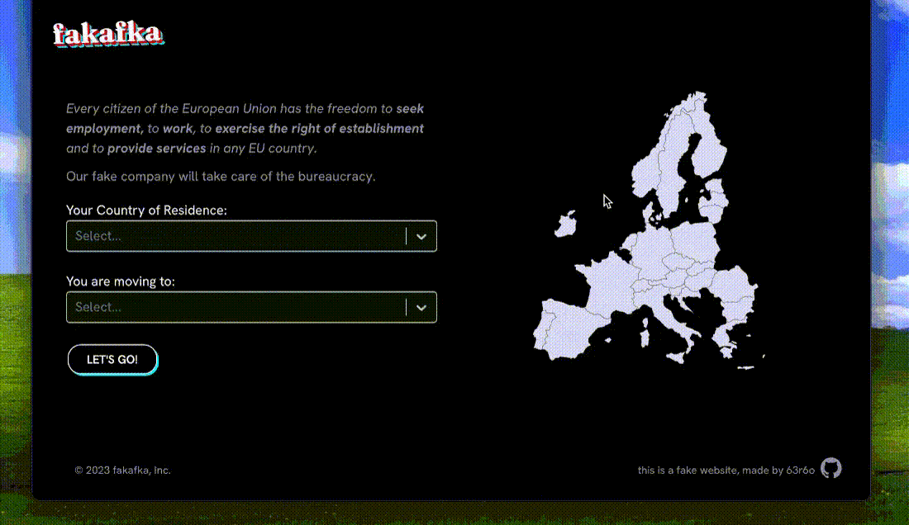

## fakafka

a react project to play with [react-select](https://github.com/JedWatson/react-select) and [react-simple-maps](https://github.com/zcreativelabs/react-simple-maps),
practice raw css and design some custom hooks[^1]

it's deployed :point_right: [here](https://63r6o.github.io/fakafka/) 👈

### what do we have here?

It's a fun little form, where alongside the `<select>` element, you can also use a pretty map to find your desired european country (except Belgium).

[^1]: _(it's also a landing page for an imaginary company)_
